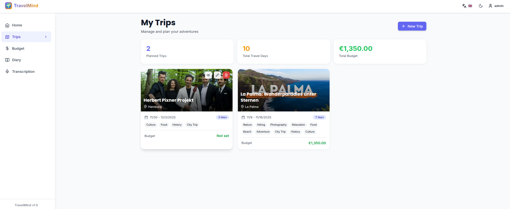
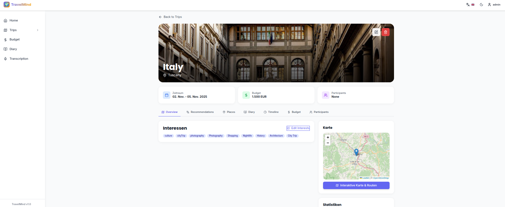

# 🌍 TravelMind

<div align="center">


**Your intelligent travel planning and diary app with AI assistance**

[](https://github.com/chicohaager/TravelMind/releases)
[](LICENSE)
[](https://hub.docker.com/u/chicohaager)
[](https://www.python.org/)
[](https://reactjs.org/)

[🇬🇧 English](#english) | [🇩🇪 Deutsch](#deutsch) | [🇫🇷 Français](#français) | [🇪🇸 Español](#español)

</div>

---

<a name="english"></a>

## 🇬🇧 English

### 📖 About TravelMind

TravelMind is a **self-hosted web application** for planning, organizing and documenting your travels. With **multi-provider AI support** (Groq FREE, Claude, OpenAI, Gemini), you get personalized recommendations and intelligent travel suggestions.

### 📸 Screenshots

<table>
  <tr>
    <td width="50%">
      
      <p align="center"><b>Dashboard - Trip Overview</b></p>
    </td>
    <td width="50%">
      
      <p align="center"><b>Trip Detail - Places & Recommendations</b></p>
    </td>
  </tr>
</table>

### ✨ Key Features

🗺️ **Trip Planning**
- Create and manage trips with destinations, dates, and budgets
- Select interests for personalized recommendations
- Upload cover images and add participants
- Track expenses and budget progress

🤖 **AI Assistant (Multi-Provider)**
- **Choose your AI provider**: Groq (FREE!), Claude, OpenAI, or Gemini
- **Your own API key**: Each user configures their own provider
- **Encrypted storage**: API keys are securely encrypted
- Personalized recommendations based on interests
- Automatic place suggestions with descriptions
- Intelligent travel tips adapted to budget and duration

📍 **Places & Attractions**
- Collect places with descriptions and categories
- GPS coordinates for map view
- Google Maps integration
- Import from travel guides (TripAdvisor, Lonely Planet)
- Mark as visited and estimate costs

📓 **Travel Diary**
- Write diary entries with Markdown support
- Upload multiple photos per entry
- Set mood and ratings (1-5 stars)
- Add tags for organization
- Export as PDF or Markdown

💰 **Budget Tracker**
- Track expenses by category
- Multiple currencies supported
- Cost sharing for group trips
- Visual budget overview with charts

🌐 **Multi-Language Support**
- 4 languages: English, German, French, Spanish
- Automatic browser language detection
- Easy language switching in the app
- Namespace-based translations for easy extension

### 🚀 Quick Start

#### Option 1: Docker Hub (Recommended)

```bash
# Download configuration
curl -O https://raw.githubusercontent.com/chicohaager/TravelMind/main/docker-compose.hub.yml
curl -O https://raw.githubusercontent.com/chicohaager/TravelMind/main/.env.example

# Configure environment
cp .env.example .env
nano .env  # Edit with your settings

# Start application
docker-compose -f docker-compose.hub.yml up -d

# Create admin user
docker exec -it travelmind-backend-prod python create_admin.py
```

**Default credentials:**
- Username: `admin`
- Password: `admin123`
- ⚠️ **Change password after first login!**

**Access:**
- Frontend: http://localhost
- Backend API: http://localhost:8000
- API Docs: http://localhost:8000/docs

#### Option 2: From Source

```bash
git clone https://github.com/chicohaager/TravelMind.git
cd TravelMind
cp .env.example .env
# Edit .env with your settings
docker-compose up -d
```

#### Option 3: ZimaOS

```bash
git clone https://github.com/chicohaager/TravelMind.git
cd TravelMind
docker-compose -f docker-compose.zimaos.yml up -d
```

### 🛠️ Technology Stack

**Backend:**
- FastAPI (Python 3.11)
- SQLAlchemy 2.0 (Async ORM)
- SQLite / PostgreSQL
- Multi-AI Provider Support

**Frontend:**
- React 18 + Vite
- TanStack Query
- Tailwind CSS
- Framer Motion
- Leaflet Maps

**Infrastructure:**
- Docker & Docker Compose
- Nginx (Production)

### 📚 Documentation

- [Deployment Guide](DEPLOYMENT.md) - Standard production deployment
- [Docker Hub Guide](DOCKER_HUB.md) - Quick deployment with pre-built images
- [ZimaOS Deployment](ZIMAOS_DEPLOYMENT.md) - Deploy on ZimaOS/NAS
- [API Documentation](http://localhost:8000/docs) - Interactive API docs

### 🤝 Contributing

Contributions are welcome! Please feel free to submit a Pull Request.

1. Fork the repository
2. Create your feature branch (`git checkout -b feature/AmazingFeature`)
3. Commit your changes (`git commit -m 'Add some AmazingFeature'`)
4. Push to the branch (`git push origin feature/AmazingFeature`)
5. Open a Pull Request

### 📄 License

This project is licensed under the MIT License - see the [LICENSE](LICENSE) file for details.

### 🙏 Acknowledgments

- **Groq** for free AI inference
- **Anthropic** for Claude AI API
- **OpenAI** for GPT API
- **Google** for Gemini API
- FastAPI, React, and all open-source contributors

---

<a name="deutsch"></a>

## 🇩🇪 Deutsch

### 📖 Über TravelMind

TravelMind ist eine **selbst gehostete Webanwendung** zur Planung, Organisation und Dokumentation deiner Reisen. Mit **Multi-Provider KI-Unterstützung** (Groq KOSTENLOS, Claude, OpenAI, Gemini) erhältst du personalisierte Empfehlungen und intelligente Reisevorschläge.

### 📸 Screenshots

<table>
  <tr>
    <td width="50%">
      
      <p align="center"><b>Dashboard - Reise-Übersicht</b></p>
    </td>
    <td width="50%">
      
      <p align="center"><b>Reise-Detail - Orte & Empfehlungen</b></p>
    </td>
  </tr>
</table>

### ✨ Hauptfunktionen

🗺️ **Reiseplanung**
- Reisen erstellen mit Ziel, Datum und Budget
- Interessen auswählen für personalisierte Empfehlungen
- Cover-Bilder hochladen und Teilnehmer hinzufügen
- Ausgaben tracken und Budget-Fortschritt verfolgen

🤖 **KI-Assistent (Multi-Provider)**
- **Wähle deinen AI-Provider**: Groq (KOSTENLOS!), Claude, OpenAI oder Gemini
- **Eigener API-Key**: Jeder Nutzer konfiguriert seinen eigenen Provider
- **Verschlüsselte Speicherung**: API-Keys werden sicher verschlüsselt
- Personalisierte Empfehlungen basierend auf Interessen
- Automatische Ortsvorschläge mit Beschreibungen
- Intelligente Reisetipps angepasst an Budget und Dauer

📍 **Orte & Sehenswürdigkeiten**
- Orte sammeln mit Beschreibungen und Kategorien
- GPS-Koordinaten für Kartenansicht
- Google Maps Integration
- Import aus Reiseführern (TripAdvisor, Lonely Planet)
- Als besucht markieren und Kosten schätzen

📓 **Reisetagebuch**
- Tagebucheinträge mit Markdown-Support schreiben
- Mehrere Fotos pro Eintrag hochladen
- Stimmung und Bewertungen (1-5 Sterne) festhalten
- Tags zur Organisation hinzufügen
- Export als PDF oder Markdown

💰 **Budget-Tracker**
- Ausgaben nach Kategorie erfassen
- Mehrere Währungen unterstützt
- Kostenteilung für Gruppenreisen
- Visuelle Budget-Übersicht mit Diagrammen

🌐 **Mehrsprachige Unterstützung**
- 4 Sprachen: Englisch, Deutsch, Französisch, Spanisch
- Automatische Browserspracherkennung
- Einfacher Sprachwechsel in der App
- Namespace-basierte Übersetzungen für einfache Erweiterung

### 🚀 Schnellstart

#### Option 1: Docker Hub (Empfohlen)

```bash
# Konfiguration herunterladen
curl -O https://raw.githubusercontent.com/chicohaager/TravelMind/main/docker-compose.hub.yml
curl -O https://raw.githubusercontent.com/chicohaager/TravelMind/main/.env.example

# Umgebung konfigurieren
cp .env.example .env
nano .env  # Mit deinen Einstellungen bearbeiten

# Anwendung starten
docker-compose -f docker-compose.hub.yml up -d

# Admin-User erstellen
docker exec -it travelmind-backend-prod python create_admin.py
```

**Standard-Zugangsdaten:**
- Benutzername: `admin`
- Passwort: `admin123`
- ⚠️ **Passwort nach erstem Login ändern!**

**Zugriff:**
- Frontend: http://localhost
- Backend API: http://localhost:8000
- API Docs: http://localhost:8000/docs

#### Option 2: Aus dem Quellcode

```bash
git clone https://github.com/chicohaager/TravelMind.git
cd TravelMind
cp .env.example .env
# .env mit deinen Einstellungen bearbeiten
docker-compose up -d
```

#### Option 3: ZimaOS

```bash
git clone https://github.com/chicohaager/TravelMind.git
cd TravelMind
docker-compose -f docker-compose.zimaos.yml up -d
```

### 🛠️ Technologie-Stack

**Backend:**
- FastAPI (Python 3.11)
- SQLAlchemy 2.0 (Async ORM)
- SQLite / PostgreSQL
- Multi-AI Provider Support

**Frontend:**
- React 18 + Vite
- TanStack Query
- Tailwind CSS
- Framer Motion
- Leaflet Maps

**Infrastruktur:**
- Docker & Docker Compose
- Nginx (Production)

### 📚 Dokumentation

- [Deployment-Anleitung](DEPLOYMENT.md) - Standard Production Deployment
- [Docker Hub Anleitung](DOCKER_HUB.md) - Schnell-Deployment mit fertigen Images
- [ZimaOS Deployment](ZIMAOS_DEPLOYMENT.md) - Deployment auf ZimaOS/NAS
- [API-Dokumentation](http://localhost:8000/docs) - Interaktive API-Docs

### 🤝 Mitwirken

Beiträge sind willkommen! Erstelle gerne einen Pull Request.

1. Repository forken
2. Feature Branch erstellen (`git checkout -b feature/NeuesFunktion`)
3. Änderungen committen (`git commit -m 'Füge neue Funktion hinzu'`)
4. Branch pushen (`git push origin feature/NeuesFunktion`)
5. Pull Request öffnen

### 📄 Lizenz

Dieses Projekt ist unter der MIT-Lizenz lizenziert - siehe [LICENSE](LICENSE) Datei für Details.

### 🙏 Danksagungen

- **Groq** für kostenlose KI-Inferenz
- **Anthropic** für Claude AI API
- **OpenAI** für GPT API
- **Google** für Gemini API
- FastAPI, React und alle Open-Source-Mitwirkenden

---

<a name="français"></a>

## 🇫🇷 Français

### 📖 À propos de TravelMind

TravelMind est une **application web auto-hébergée** pour planifier, organiser et documenter vos voyages. Avec **support IA multi-fournisseurs** (Groq GRATUIT, Claude, OpenAI, Gemini), vous obtenez des recommandations personnalisées et des suggestions de voyage intelligentes.

### ✨ Fonctionnalités principales

🗺️ **Planification de voyage** - Créer des voyages avec destinations, dates et budgets
🤖 **Assistant IA** - Choisissez votre fournisseur : Groq (GRATUIT!), Claude, OpenAI ou Gemini
📍 **Lieux** - Collecter des lieux avec GPS et intégration Google Maps
📓 **Journal de voyage** - Écrire des entrées avec photos et humeur
💰 **Suivi budgétaire** - Suivre les dépenses par catégorie
🌐 **4 langues** - Anglais, Allemand, Français, Espagnol

### 🚀 Démarrage rapide

```bash
# Docker Hub (Recommandé)
curl -O https://raw.githubusercontent.com/chicohaager/TravelMind/main/docker-compose.hub.yml
docker-compose -f docker-compose.hub.yml up -d
```

---

<a name="español"></a>

## 🇪🇸 Español

### 📖 Acerca de TravelMind

TravelMind es una **aplicación web autoalojada** para planificar, organizar y documentar tus viajes. Con **soporte de IA multi-proveedor** (Groq GRATIS, Claude, OpenAI, Gemini), obtienes recomendaciones personalizadas y sugerencias de viaje inteligentes.

### ✨ Características principales

🗺️ **Planificación de viajes** - Crear viajes con destinos, fechas y presupuestos
🤖 **Asistente de IA** - Elige tu proveedor: Groq (¡GRATIS!), Claude, OpenAI o Gemini
📍 **Lugares** - Coleccionar lugares con GPS e integración de Google Maps
📓 **Diario de viaje** - Escribir entradas con fotos y estado de ánimo
💰 **Control de presupuesto** - Seguir gastos por categoría
🌐 **4 idiomas** - Inglés, Alemán, Francés, Español

### 🚀 Inicio rápido

```bash
# Docker Hub (Recomendado)
curl -O https://raw.githubusercontent.com/chicohaager/TravelMind/main/docker-compose.hub.yml
docker-compose -f docker-compose.hub.yml up -d
```

---

<div align="center">

**Made with ❤️ by the TravelMind Team**

[GitHub](https://github.com/chicohaager/TravelMind) • [Docker Hub](https://hub.docker.com/u/chicohaager) • [Issues](https://github.com/chicohaager/TravelMind/issues)

*Happy Travels! 🌍✈️*

</div>
